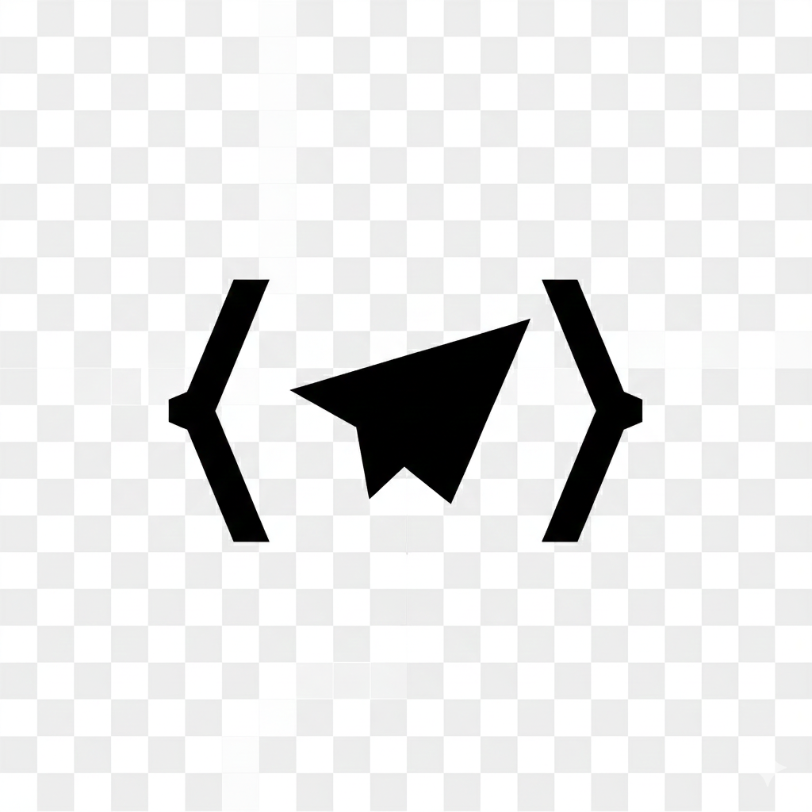

# Vibegram

Control [Claude Code](https://claude.ai/claude-code) from Telegram. Voice-first mobile coding.



**[Website](https://studio-sunnyfield.github.io/vibegram/)** · **[Download](https://github.com/Studio-Sunnyfield/vibegram/releases/latest)**

## What is this?

Vibegram is a macOS menu bar app that bridges Telegram to Claude Code CLI. Send voice messages or text from your phone, and Claude Code executes on your machine.

**Use cases:**
- Voice-code from anywhere (Telegram transcribes for you)
- Quick fixes without opening your laptop
- Mobile pair programming with Claude
- Use Claude Code while AFK - meetings, commutes, couches

## Prerequisites

1. **Claude Code CLI** - Install from [claude.ai/claude-code](https://claude.ai/claude-code)
2. **Telegram Bot Token** - Create a bot via [@BotFather](https://t.me/botfather)
3. **Your Telegram User ID** - Get it from [@userinfobot](https://t.me/userinfobot)

## Installation

### Download (Recommended)

1. Download the latest `.dmg` from [Releases](https://github.com/Studio-Sunnyfield/vibegram/releases)
2. Drag `Vibegram.app` to Applications
3. Open the app (it will be blocked by Gatekeeper)
4. Go to **System Preferences → Privacy & Security**
5. Scroll to **Security** and click **"Open Anyway"**
6. Configure your bot token and user ID in Settings

### Build from Source

```bash
# Clone
git clone https://github.com/Studio-Sunnyfield/vibegram.git
cd vibegram

# Install dependencies
npm install
cd app && npm install && cd ..

# Build
npm run build

# App is at app/dist/mac-universal/Vibegram.app
```

## Usage

### Bot Commands

| Command | Description |
|---------|-------------|
| `/start` | Welcome message |
| `/new` | Start fresh conversation |
| `/stop` | Stop current task |
| `/resume` | Continue previous session |
| `/status` | Show current status |
| `/cd <path>` | Change working directory |

### Features

- **Images** - Send screenshots for Claude to analyze
- **Session persistence** - Resume where you left off
- **Live status** - See what Claude is doing in real-time
- **Auto-update** - Checks for new versions on startup

### Status Indicators

The menu bar icon shows:
- **Filled** - Bot is running
- **Outline** - Bot is stopped

In chat:
- `💭 Thinking...` - Processing your request
- `🔧 Running command` - Executing a tool
- `💭 Responding...` - Generating response
- `✅ Done` - Task complete

## Environment Variable

When Claude Code runs via Vibegram, it sets:

```bash
VIBEGRAM_SOURCE=telegram
```

Use this in [Claude Code hooks](https://claude.ai/claude-code/hooks) to customize behavior for Telegram messages.

## Security

- **Single user only** - Only your Telegram user ID can interact with the bot
- **Local execution** - Claude Code runs on your machine, not in the cloud
- **No data collection** - Your conversations stay between you and Claude

## Troubleshooting

**App won't open:**
1. Try to open the app
2. Go to **System Preferences → Privacy & Security**
3. Click **"Open Anyway"** under Security

**Bot won't start:**
- Verify your bot token with [@BotFather](https://t.me/botfather)
- Check your user ID with [@userinfobot](https://t.me/userinfobot)
- Ensure Claude Code CLI is installed: `claude --version`

**Commands not working:**
- Make sure the bot is running (filled icon in menu bar)
- Check the project directory exists

## Roadmap

**v1.1 - CLI Mode**
- Standalone CLI (no Electron dependency)
- `npx vibegram` or `vibegram serve`
- Deploy on any server/VM, run headless
- Config via env vars or `~/.vibegram.json`

**v1.2 - Multi-Agent Support**
- Abstract the "coding agent" interface
- Support opencode, aider, other CLIs
- `--agent claude|opencode|aider`

**v1.3 - Multi-Messenger**
- Abstract the "messenger" interface
- Discord, Slack, WhatsApp, Signal
- Same bot logic, different transports

**v2.0 - Cross Platform**
- Linux support (CLI mode)
- Windows support
- System tray for non-macOS

## License

MIT - see [LICENSE](LICENSE)

---

Made by [Studio Sunnyfield](https://sunnyfield.studio)
